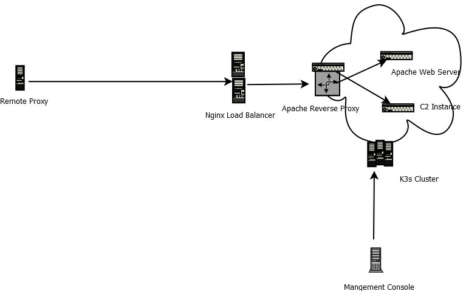

## **Overview For Red Team Deployable Infrastructure**

These blog entries are going to be about my design of a dynamic red team infrastructure using Kubernetes.  This fist blog is going to go through the basic components and what will make up the cluster.   

First, why Kubernetes?  Well overall it allows for high availability, can utilize our bare metal, VMs, or VPS more efficiently and allows for easy automation.  The Kubernetes distribution utilized in this setup will be K3s.  K3s is a much lighter version of Kubernetes allowing us to use the master as worker nodes and utilizing lower ram machines.  K3s was designed for edge computing which is a good fit for a red team infrastructure which does not need a massive enterprise build but still get a lot of the advantages of using one.  This will still give us a devops deployment and infrastructure by code.  

To build these components you will need some sort of virtual infrastructure, bare metal or a cloud provider.  I amm not going to go through how to setup that up and that will be your personal choice.  There are a lot of components since this design is for a production environment and not a laptop.  I personally use Proxmox and have a prebuilt Ubuntu template I use.  
  
We will need several components for this infrastructure.   In each blog I will go into a lot more detail of components, this first blog is just an overview of everything. 
A Management server:
- Docker --- For building images and pushing to our private docker registry
- Gitea --- A light weight git repistory
- GoCD --- An easy to use CI/CD
- Ansible --- A python based automation which will be used to automate the entire infrastructure 
- kubectl --- For managing the Kubernetes infrastructure
  

K3s:
- 3 masters controllers per cluster for HA
- 3 worker nodes per cluster for more resources
- Longhorn installed for volume distribution 
- Fluentd  for sending logs to a logging server

  
Internal to the cluster core functions:
- Apache reverse proxy  This will be used instead of an ingress controller to allow the use of a script called mkhtacess_red allowing for protection against blueteams and sandboxes
- Apache web server  this will host any dummy sites, phishing site websites, etc.
- Docker registry
  

Internal C2 Components:
  - Covenant C2
  - Shadow C2
  
  
Logging and alerting:
- Graylog -- A logging server for getting logs from containers and applications
- Slack -- An online chat service so we can set alerts to our phones

  
Remote Proxies -- These are the redirectors for our deployed future c2s.  These will be deployed usually as nano machines in the whatever cloud provider one chooses to use and reverse ssh tunnel to our load balancers.

  
2 Nginx load blancers -- These accept reverse ssh from our remote proxies 

  
The basic layout of the infrastructure looks a bit like this:

Each blog entry will compromise of setting up various components of the infrastructure.  I will caveat this is not necessarily using industry standards and I might do things my way instead of what is recommended though I am open for feedback.  This is the overall breakdown of future blogs which will be published.  
  
1. Setting up the management server
2. Deploying our staging and production cluster using ansible
3. Creating our core redteam infrastructure (registry, apache reverse proxy and web server)
4. Logging (deploying Fluentd, Graylog and Slack)
5. Building c2 instances and deploying the instances to our k3s cluster
6. Building our cloud remote proxies
7. Adding some of security that we have been ignoring (ansible vault, ingress/egress controls, RBAC)
8. How to update our deployed components, adding additional projects (2 clients) and cleaning up

