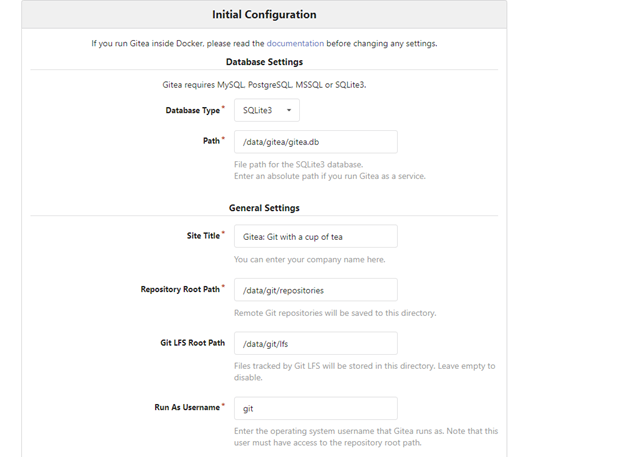
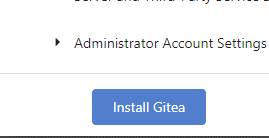
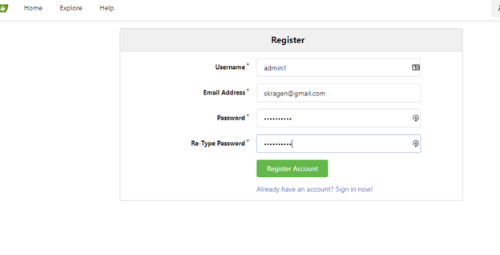
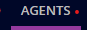
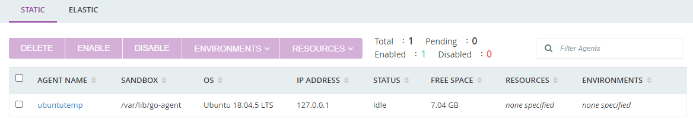
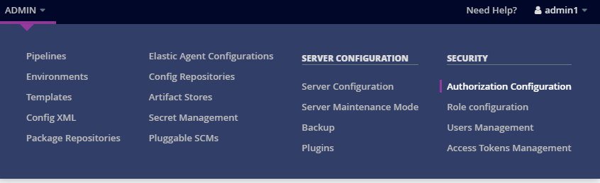
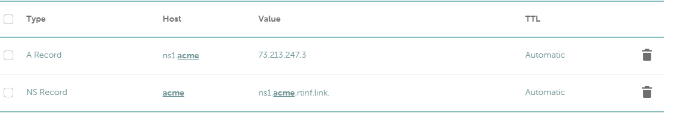
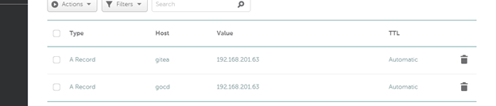

In this first technical entry for setting up the infrastructure we are going to setup the mnagement console for our infrastructure.  This will act as a jump console and deployment console for the main cluster.  For the manager the first thing we have to do is generate ssh keys if this is not built into your template.  Ansible is going to need keys to login remotely to our cluster machines. 
To generate your keys use this command:

```
ssh-keygen -t ecdsa -b 521
```
When asked, do not choose a password.  Ansible is going to need password less ssh to work correctly.  We will go into details about using ansible and deployment in the next blog entry when we setup the K3s cluster. 
 
The .ssh directory should now have a key called id_ecdsa and an id_ecsda.pub.  These will be needed for future parts of this deployment and by the GoCD server.

We are then going to install ansible.  The easiest way to install ansible is to perform the following commands.

```
sudo apt-get install python-pip3
sudo pip3 install ansible

```
Ansible will be used for configuring all the cluster and for building out our deployments in our build out pipelines.  

Next we will install docker.  Docker will be used for building our images deployed to the Kubernetes cluster  and to run out git repository.  
To install docker perform the following commands:

```
sudo apt-get remove docker docker-engine docker.io containerd runc
sudo apt-get update

sudo apt-get install \
    apt-transport-https \
    ca-certificates \
    curl \
    gnupg-agent \
    software-properties-common
curl -fsSL https://download.docker.com/linux/ubuntu/gpg | sudo apt-key add -
sudo add-apt-repository \
   "deb [arch=amd64] https://download.docker.com/linux/ubuntu \
   $(lsb_release -cs) \
   stable"
sudo apt-get update
sudo apt-get install docker-ce docker-ce-cli containerd.io
pip3 install docker-compose
```

You have to add your user to the docker group.  This will allow you to run docker commands as your regular user.  
```
sudo usermod -aG docker <username>
```

Logout and relogin into you account and verify docker is working as expected
Run the following commands:
```
docker version
docker-compose version
```
If there are no errors then everything should be working as expected.  There will be more details on using docker later in this series.  For now is just a practical use for setup of this section.

Now that docker is installed we are going to setup our git repistory.  We are going to use an easy to install repository called gitea.   In the home directory of the management console create a directory called gitea

```
mkdir gitea
cd gitea
```

```
Now nano docker-compose.yaml
Paste into this file:

version: "3"

networks:
  gitea:
    external: false

services:
  server:
    image: gitea/gitea:1.13.0
    container_name: gitea
    environment:
      - USER_UID=1000
      - USER_GID=1000
    restart: always
    networks:
      - gitea
    volumes:
      - ./gitea:/data
      - /etc/timezone:/etc/timezone:ro
      - /etc/localtime:/etc/localtime:ro
    ports:
      - "8888:3000"
      - "222:22"
```

Then run:

```
docker-compose up -d
```

Browse to the ip of your management console http://<your ip>:8888.  Click register and this will start the setup.  


 
Accept all the defaults and click the install Gitea button:


 


Once it redirects you to http://localhost:3000 browse back to your host on port 8888
Click register again and this time it will create your first account which is the admin account.   We will secure this with SSL later on after installing the CI/CD.  

 
Next we are going to install our CI/CD.  I prefer GoCD because its easy to use, can call command lines as part of the pipline, so I can use it with ansible and supports easy templating.  Installing GoCD server is very similar to how we install docker.  Add the repository and then install the package. 
Perform the following in your console: 

```
echo "deb https://download.gocd.org /" | sudo tee /etc/apt/sources.list.d/gocd.list
curl https://download.gocd.org/GOCD-GPG-KEY.asc | sudo apt-key add -
sudo apt-get update

sudo apt-get install go-server
```


Next we will install the agent:

```
sudo apt-get install go-agent

Finally start both the agent and the server
sudo systemctl start go-server
sudo systemctl start go-agent
```

Ensure the server has started by browsing to http://<yourip>:8153

Click Agents on the top menu



We should see our local machine registered as an agent.


We are going to need to use the ssh keys we generated later to deploy to our servers.  To do this we are going to issue the following commands at the console.

```
mkdir /var/go/.ssh
sudo chmod 700 /var/go/.ssh
sudo chown go:go /var/go/.ssh
cd ~/.ssh
sudo id_ecdsa /var/go/.ssh
sudo chown go:go /var/go/.ssh/id_ecdsa
sudo chmod 600 /var/go/.ssh/id_ecdsa
```

The last tool we are going to install before we secure our 2 web services on ssl is kubectl.  This will allow us to administrate  the Kubernetes  clusters once they are setup.  

Like most tools these days there is a repository that allows us to install and maintain the package.  Type the following in your console:

```
sudo apt-get update && sudo apt-get install -y apt-transport-https gnupg2 curl
curl -s https://packages.cloud.google.com/apt/doc/apt-key.gpg | sudo apt-key add -
echo "deb https://apt.kubernetes.io/ kubernetes-xenial main" | sudo tee -a /etc/apt/sources.list.d/kubernetes.list
sudo apt-get update
sudo apt-get install -y kubectl
```

The last thing we want to is secure our 2 webservices with SSL.  To do this we are going to register a domain.  I use Namecheap.  I registered rtinf.link for my infrastructure so you will see references to that through the rest of these guides.  This allows one to register certificates with letsencrypt and namecheap is not expensive to register domains with.  First lets setup apache.

```
sudo apt-get install apache2
```

If you had noticed that when you tested our GoCD server it did not have any authentication.  We are going to enable that now but it requires htpasswd and that is part of the apache package.  

To create a password perform this command:

```
sudo htpasswd -c -B /etc/go/gocd.passwd admin1
chown go:go /etc/go/gocd.passwd

```
Go back to your GoCD server at http:/<console ip>:8153
On the top menu click admin/authorization configuration

Click the Add Button then choose Password File Authentication under plugin


For id you can define anything
Under password path enter /etc/go/gocd.passwd


Click test connection and save.

This will force you to refresh and login with the new username and password.  This should give one an authenticated user now on the GoCD server.

We are going to setup the acme-dns and certbot.  
First we are going to install certbot with the following command:

```
pip3 install certbot
```
Then we are going to get acme-dns:

```
git clone https://github.com/joohoi/acme-dns
```
Instead of installing go and setting up a service we are going to use docker.  The developer provides the docker-compose image which needs a few modifications to work for us.
Edi the docker-compose file and make it match this one
```
version: '2'
services:
  acmedns:
    build:
      context: .
      dockerfile: Dockerfile
    image: joohoi/acme-dns:latest
    restart: always
    ports:
      - "5353:53"
      - "5353:53/udp"
      - "8081:8081"
    volumes:
      - ./config:/etc/acme-dns:ro
      - ./data:/var/lib/acme-dns

```
Now make a config directory:

```
mkdir ~/acme-dns/config
nano config.cfg
```

In the config.cfg paste except replacing rfinf.link with your actual domain and the ip's with your external ip's of your network:


```
#/etc/acme-dns/config.cfg
[general]
# DNS interface
listen = ":53"
protocol = "udp"
# domain name to serve the requests off of
domain = "acme.rtinf.link"
# zone name server
nsname = "ns1.acme.rtinf.link"
# admin email address, where @ is substituted with .
nsadmin = "admin.rtinf.link"
# predefined records served in addition to the TXT
records = [
    "acme.rtinf.link. A 55.55.55.55",
    "ns1.rtinf.link. A 55.55.55.55",
    "acme.rtinf.link. NS ns1.acme.rtinf.link.",
]
debug = false

[database]
engine = "sqlite3"
connection = "/var/lib/acme-dns/acme-dns.db"

[api]
api_domain = ""
ip = "0.0.0.0"
disable_registration = false
port = "8081"
tls = "none"
corsorigins = [
    "*"
]
use_header = false
header_name = "X-Forwarded-For"

[logconfig]
loglevel = "debug"
logtype = "stdout"
logformat = "text"

```

Now run these commands:

```
cd ~/acme-dns/
docker-compose build
docker-compose up -d
```
After launching the docker application on our manager you will need to open a firewall rule to point from your external ip to the acme-dns.  The rule should go from port 53 to port 5353 on our management console.

Lastly, we need to get the certbot hook
First make sure the lets encrypt directory exists and wget the dns hook. 
Run the following commands in your console:

```
sudo mkdir /etc/letsencrypt
sudo wget -O /etc/letsencrypt/acme-dns-auth.py https://raw.githubusercontent.com/joohoi/acme-dns-certbot-joohoi/master/acme-dns-auth.py
chmod +x /etc/letsencrypt/acme-dns-auth.py
```

Modify the top part of the file to have match this line:

```
ACMEDNS_URL = "http://localhost:8081"
```


Wherever you dns is being hosted you have to create entries similar to this:
 

Now we need to run the certbot program. Now run the following on the console: 


```
certbot certonly -d "*.rtinf.link" -d "rtinf.link" --agree-tos --manual-public-ip-logging-ok --server https://acme-v02.api.letsencrypt.org/directory --preferred-challenges dns --manual --manual-auth-hook /etc/letsencrypt/acme-dns-auth.py --debug-challenges
```

This will generate a cname to put in our DNS.  Create the cname entry which it generates on your DNS provider. I find the whole thing takes a while to propagate so you might want to wait a few minutes and the verification.  If it fails try again.  

Finally add a crontab to renew the cert regularly

```
Sudo crontab -e
43 6 * * * certbot renew --post-hook "systemctl restart apache2"
```


Now that we have our wildcard cert and it renews itself we are going to setup our apache reverse proxy.  First we need to enable the correct modules for apache.  Run the following on your console:

```
a2enmod proxy
a2endmod proxy_http
a2enmod proxy_http
a2enmod ssl
a2enmod proxy_balancer
a2enmod lbmethod_byrequests
a2enmod rewrite
a2enmod headers
```
Then we need to create a new file in /etc/apache2/site-available which looks like this:
```
Nano /etc/apache2/sites-available/reverse-proxy.conf
```
Now add the following into the this file:

```
<VirtualHost *:443>
        # The ServerName directive sets the request scheme, hostname and port th                                                                                                                                                                                                                                                                                                                                                           at
        # the server uses to identify itself. This is used when creating
        # redirection URLs. In the context of virtual hosts, the ServerName
        # specifies what hostname must appear in the request's Host: header to
        # match this virtual host. For the default virtual host (this file) this
        # value is not decisive as it is used as a last resort host regardless.
        # However, you must set it for any further virtual host explicitly.
        #ServerName www.example.com
        ServerAdmin webmaster@localhost
        ServerName  gitea.rtinf.link

        DocumentRoot /var/www/html
#        Include /etc/apache2/custom/ssloptions.conf
        # Enable SSL
        SSLEngine On
        SSLCertificateFile /etc/letsencrypt/live/rtinf.link/fullchain.pem
        SSLCertificateKeyFile /etc/letsencrypt/live/rtinf.link/privkey.pem

        <Directory /var/www/>
                Options Indexes FollowSymLinks MultiViews
                AllowOverride All
                Order allow,deny
                allow from all
        </Directory>

        ProxyPreserveHost On
        ProxyPass "/" "http://127.0.0.1:8888/"
        ProxyPassReverse "/"  "http://127.0.0.1:8888/"

</VirtualHost>

<VirtualHost *:443>
        # The ServerName directive sets the request scheme, hostname and port th                                                                                                                                                                                                                                                                                                                                                           at
        # the server uses to identify itself. This is used when creating
        # redirection URLs. In the context of virtual hosts, the ServerName
        # specifies what hostname must appear in the request's Host: header to
        # match this virtual host. For the default virtual host (this file) this
        # value is not decisive as it is used as a last resort host regardless.
        # However, you must set it for any further virtual host explicitly.
        #ServerName www.example.com
        ServerAdmin webmaster@localhost
        ServerName  gocd.rtinf.link

        DocumentRoot /var/www/html
 #       Include /etc/apache2/custom/ssloptions.conf
        # Enable SSL
        SSLEngine On
        SSLCertificateFile /etc/letsencrypt/live/rtinf.link/fullchain.pem
        SSLCertificateKeyFile /etc/letsencrypt/live/rtinf.link/privkey.pem

        <Directory /var/www/>
                Options Indexes FollowSymLinks MultiViews
                AllowOverride All
                Order allow,deny
                allow from all
        </Directory>

        ProxyPreserveHost On
        ProxyPass "/" "http://127.0.0.1:8153/"
        ProxyPassReverse "/"  "http://127.0.0.1:8153/"
        RequestHeader set X-Forwarded-Proto "https"

</VirtualHost>
```

Finally create 2 dns entries in your provider which look like this, using your ip's instead of mine:

 


Restart apache on the console: 
```
systemctl restart apache2
```

You should now be able to browse to https://gitea.<youdomainname> and https://gocd.<youdomain>

Now that the overall management console is setup in the next blog we are going to go through and discuss using ansible and setting up our K3s cluster.

