## K3s Cluster Setup

In this second technical article I am going to go through the basics of ansible to do some basic configuration of our hosts.  Then we will use someone elses ansible play book to create our K3s cluster.  The first thing I want to do is establish an git repository  for our infrastructure deployment.  This will help in documenting what was done and for future deployments of clusters.  Lets browse over to our gittea repository and make a new project.  Im going to call this repository rtk3sinf.  First click the + in the upper right hand corner and click New Repository.


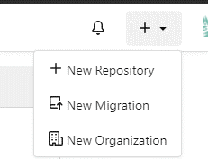

Fill in the fields as necessary


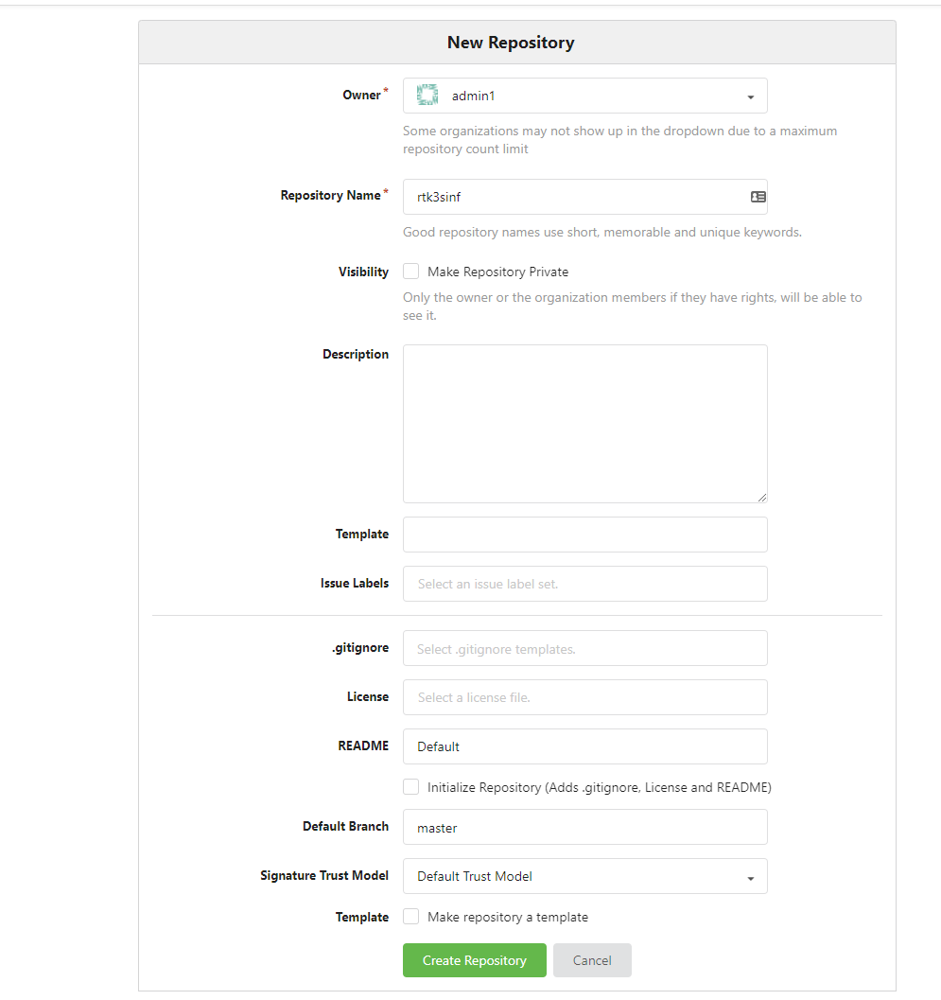

On your console run these commands changing the url to your gitea url:

```
mkdir rtk3sinf
touch README.md
git init
git add README.md
git commit -m "first commit"
git remote add origin https://gitea.rtinf.link/admin1/rtk3sinf
git push -u origin master
```

This will establish your repository we will add the repository that will install K3s as a submodule.  That way we can update it if we needed and keep revision controls and rollback if something is truly smashed.  Then we will discuss parts of ansible and make some basic playbooks of our own.   Ill also release this in the public repository for people to clone or fork.  
Now that we have a repository with a role to deploy the cluster and to do some basic maintenance with ansible.   So what is ansible?  Redhat defines ansible as a simple, agentless IT automation that anyone can use.  Really, the only requirement on a machine is python and the controller to have ansible installed.  Ansible can run single commands on a host with command ansible but we are going to focus more on playbooks.  Ansible playbooks is a collection of tasks or to-do lists that can be automated on a defined list of servers.  The first task we are going to do is make sure our ssh-key is on each sever.  This playbook come directly from stackoverflow but I have found it very useful.  Ill break down all the parts and the command to execute it once we have created it.  First lets create a directory called misctasks.

```
mkdir misctasks
```
now lets create the play book itself:
```
---
- hosts: all
  tasks:

  - name:  Deploy SSH key
    authorized_key:
      user: admin1
      state: present
      key: "{{ lookup('file', '~/.ssh/id_ecdsa.pub') }}"
```


Lets break down the playbook so we know what is going on.  The first line is hosts.  The hosts are the defined by inventory file and we can create categories.  The built-in category all is tell ansible to use every host in the inventory file.  The next section is tasks.  This could be as single action or several action to perform on this list of hosts.  On each tasks its best practice to put a name of the task, this will also output as the task is being performed.  The next line authorized_key is the module used by ansible and will do a specific set of tasks based on that module.  In this case its going to perform and lookup on the our id_escdsa.pub file and add it the authorized ssh key list.  The state variable only adds it if it doesnt already exist and the user variable is the hosts user to add it too.  So the one thing we are missing from this and our future ansible books is the inventory.  We are going to share this inventory with the K3s module and will add to it as we go.  
Lets make the directory inventory at the root of our project.
```
mkdir inventory
```
After that, our structure should look like this:
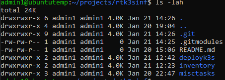


The author of the deployment module for K3s uses a yaml based inventory file to define the hosts and variables.  Later in this project we will define inventory files with the simple format instead. Lets make our inventory file.
It should look something like this:
```
k3s_cluster:
  hosts:
    k3smaster1:
      ansible_host: 192.168.200.105
      ansible_python_interpreter: /usr/bin/python3
      k3s_control_node: true
    k3smaster2:
      ansible_host: 192.168.201.224
      ansible_python_interpreter: /usr/bin/python3
      k3s_control_node: true
    k3smaster3:
      ansible_host: 192.168.200.169
      ansible_python_interpreter: /usr/bin/python3
      k3s_control_node: true
    k3sworker1:
      ansible_host: 192.168.200.249
      ansible_python_interpreter: /usr/bin/python3
      k3s_control_node: false
    k3sworker2:
      ansible_host: 192.168.200.212
      ansible_python_interpreter: /usr/bin/python3
      k3s_control_node: false
    k3sworker3:
      ansible_host: 192.168.200.120
      ansible_python_interpreter: /usr/bin/python3
      k3s_control_node: false
```

When we go to apply the cluster, Ill break down what is important in this file.  For now, lets test the inventory file and then deploy our ssh key.  To use password authentication with ansible you need to install sshpass.
```
apt-get install sshpass -y
export ANSIBLE_HOST_KEY_CHECKING=False
ansible -i k3scluster.yml -m ping all -k

```
You should get a response like this:


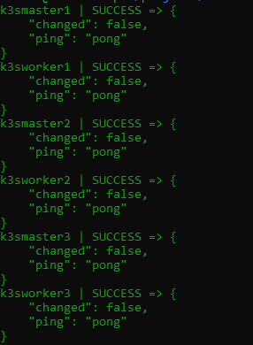

So it appears our hosts are reachable.  The export variable we defined tells ansible not to host verify.  Since I currently trust all these hosts it helps save some time.  

Lets run our playbook now.  From the root of the project folder lets run the ansible-playbook command:

```
ansible-playbook -i inventory/k3scluster.yml misctasks/ssh_deploy_key.yaml -k

```
You should get a result similar to this:

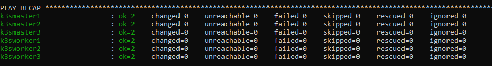

On each server your sudo file should have a line similar to this:
```
# Allow members of group sudo to execute any command
%sudo   ALL=(ALL) NOPASSWD: ALL
```

Since these are new servers and, in my case, made from a template, they all have the same host name.  I like to have my clusters to have the proper the hostname and added all the hosts in the cluster in /etc/hosts so they can resolve themselves without depending on dns.  We are going to create another misctask playbook to perform this task.   This will use a different module and will change the hostname and add them all to /etc/hosts on all the servers.  This playbook would be something like this.
So first lets create the task file.  Edit a file called etchosts.yaml in our misctasks folder.  The content of this playbook is below:
```
---
- hosts: all
  become: true
  tasks:

  - name:  set localhost name to inventory hostname
    hostname:
      name: "{{ inventory_hostname_short }}"

  - name: Generate /etc/hosts file
    template:
      src=templates/hosts.j2
      dest=/etc/hosts

```
Next make a directory called templates in the misctasks folder.
```
mkdir templates
```

In this directory edit a file called hosts.j2
Make the contents of this file:
```
# {{ ansible_managed }}
127.0.0.1   localhost localhost.localdomain localhost4 localhost4.localdomain4
::1         localhost localhost.localdomain localhost6 localhost6.localdomain6



{{ hostvars[item]['ansible_host'] }}  {{ item }} {{ short_name[0] }}

```

Now in this playbook we have 2 tasks.  One is pretty obvious.  The hostname module makes the inventory hostname based on the hostname in the inventory file.  The second module we use is template.  This lets us define a file and perform a loop through the our inventory and ips and place them in a proper /etc/host file.  This is a simple template but a good example.  Ansible uses Jinja2 templating to enable dynamic expressions and access to variables. To call variables in ansible we use the {{ variable name }}.  This template uses a lot of built in variables.   
- play_host - The list of all the hosts in the inventory.
- short_name  We take our item defined in our list and split on dots, in case use full host names
- hostvars[item] - reverences the the host variables in the inventory file 
- ansible_host - is the ip address as defined in the inventory file
- item - is what we defined in our loop to iterate through


One other thing we added to this playbook is the become: true.  This function tells ansible to become root to perform this task.   This is why the user must be a member of the  sudos group without password.  
To run this playbook we will simply to this from the root of the project folder:

```
ansible-playbook -i inventory/k3scluster.yml misctasks/etchosts.yaml
```
If successful we should get a result like this:

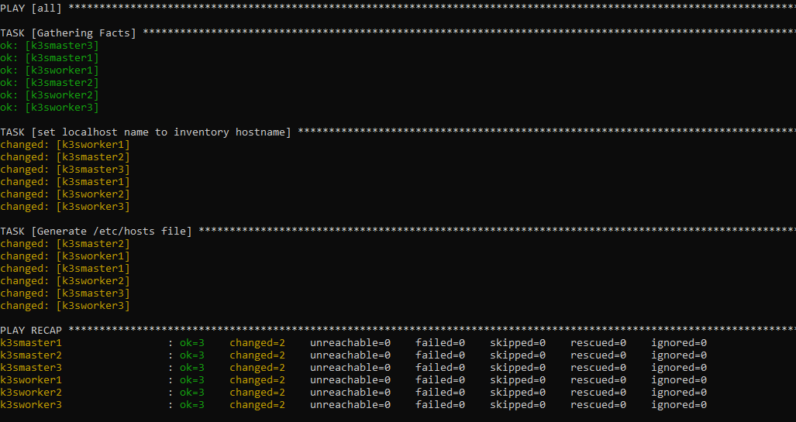

If I ssh into my k3smaster1 you should be able to see the new hostname in the prompt and if I cat /etc/hosts you should see all our hosts listed.  

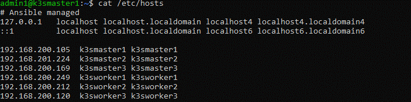

The last playbook for prepping all my hosts is to do a full update of patches on our hosts.  This playbook is good for routine maintenance but more importantly I want to make sure all my machines are fully patched before installing the K3s cluster.   This script is setup to reboot the system after, so it might not be good for routine maintenance but you could modify it.  
In the misctask directory edit a file called osupdate.yaml and place this as its content:
---
- hosts: all
  become: true
  tasks:
    - name: Update apt repo and cache on all Debian/Ubuntu boxes
      apt: update_cache=yes force_apt_get=yes cache_valid_time=3600

    - name: Upgrade all packages on servers
      apt: upgrade=dist force_apt_get=yes

    - name: Check if a reboot is needed on all servers
      register: reboot_required_file
      stat: path=/var/run/reboot-required get_md5=no

    - name: Reboot the box if kernel updated
      reboot:
        msg: "Reboot initiated by Ansible for kernel updates"
        connect_timeout: 5
        reboot_timeout: 300
        pre_reboot_delay: 0
        post_reboot_delay: 30
        test_command: uptime
      when: reboot_required_file.stat.exists


For a good explaination of this playbook refer to this blog page:
**https://www.cyberciti.biz/faq/ansible-apt-update-all-packages-on-ubuntu-debian-linux/**

From the root of our project run this command:

```
ansible-playbook -i inventory/k3scluster.yml misctasks/osupdate.yaml
```

This should update all our packages and reboot our servers if necessary, then check if they came back.
If successful you should get results similar to this:


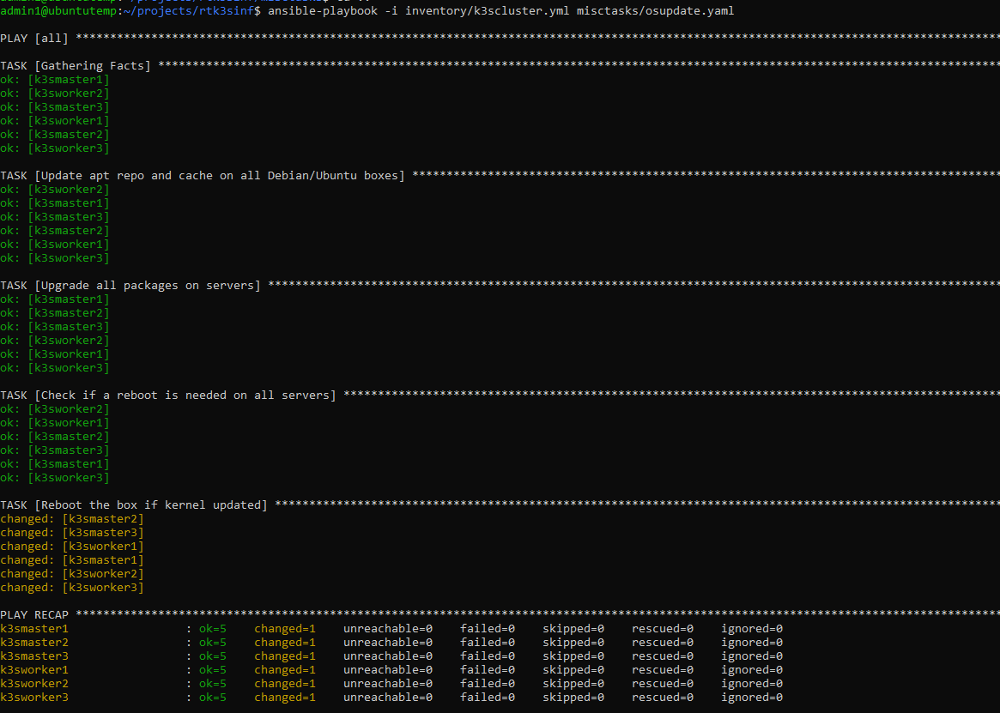

Now that our machines are prepped it is time to install the Kubernetes cluster.  In ansible a role is usually a specific defined type of server with a set of tasks connected to it.  We will create a playbook to use this role and setup our cluster in one command.  Ansible also has an application store.  This basically adds new modules and roles to ansible that are developed by other people.  In this case we are going to install a role for deploying k3s in a HA cluster.  To install this third party role we will use the command:

```
ansible-galaxy install xanmanning.k3s
```

Now lets make the directory in the root of project called deployk3s

```
mkdir deployk3s
```

In this directory edit a file called main.yaml and place this content:
```
---

- name: Build a cluster with HA control plane
  hosts: k3s_cluster
  vars:
    k3s_become_for_all: true
    k3s_etcd_datastore: true
    k3s_use_experimental: true  # Note this is required for k3s < v1.19.5+k3s1
  roles:
    - xanmanning.k3s
```

As you can see we are calling the role xamanning.k3s.   This role will form our entire cluster from our inventory file.  Other variables defined in this role are etcd_datastore and the the experimental.  These are needed to setup the high availability without the use of an external database.  This places an etcd database on all the master nodes.   The jobs and management of the cluster are being replicated between our master nodes.  If one of the nodes goes down, one of the other 2 master nodes will pick up the slack and the cluster will continue to function.  Though the cluster wont allow updates to it until you have at least 3 master nodes.  Also, the RAFT protocol, which is what etcd uses, requires odd numbers of controplanes to be deployed.
In the inventory file we defined which machines are the master nodes and which are the works by declaring the k3s_control_node to true or false.  If you notice all our masters are set to true and our workers are set to false.  Now lets deploy the cluster.  This will take a bit of time and perform a lot of tasks.  From the root of our project run this command.

```
ansible-playbook -i inventory/k3scluster.yml deployk3s/main.yaml
```

At the end of the deployment  you should get similar results:


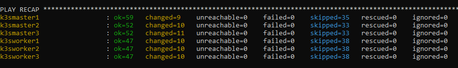

Now that our cluster is formed lets make sure everything looks ok.  My master node is at 192.168.200.105.  Run the command similar to this changing the ip to your ip:

```
ssh 192.168.200.105 sudo kubectl get nodes
```

You should get similar output to this if everything is ok:


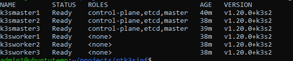

Now lets verify all the pods are running correctly with the command, changing the ip to your ip:
```
ssh 192.168.200.105 sudo kubectl get pods all-namespaces
```
Your output should look something like this:
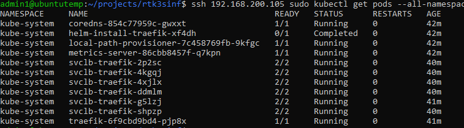

Now lets setup kubectl so we can deploy our applications directly from our management console.  To do this we are going to need a copy of the config file that k3s generated when it installed.  It places this config file in /etc/rancher/k3s/k3s.yaml

Lets go back to our home directory and make a directory called .kube:
```

mkdir ~/.kube
```

Now to copy the config file to our .kube directory changing the ip to your first masters ip:

```
ssh 192.168.200.105 sudo cat /etc/rancher/k3s/k3s.yaml > ~/.kube/config
```

Now edit the file ~/.kube/config and change the line:

```
https://127.0.0.1:6443
```

To the ip of your first master node, in my case:
```
https://192.168.200.105:6443
```

I should now be able to run the command from our management console:
kubectl get nodes

You should get similar output to this:


Since the GoCD account will need the same access we will repeat this
Run these commands:

```
sudo mkdir /var/go/.kube
sudo chown go:go /var/go/.kube
sudo cp /var/go/.kube/config
sudo chown go:go /var/go/.kube/config
```

Now lets verify the go account used by GoCD has access to the cluster:

```
sudo su go
kubectl get nodes
exit

```
You should get similar output to this:
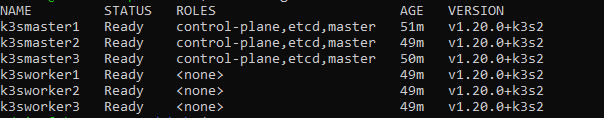

Now that both accounts should be configure for access to the cluster from our management console.

This should complete our cluster.  In the next blog I will start discussing some the actual services that will be used for our core RT infrastructure.  

